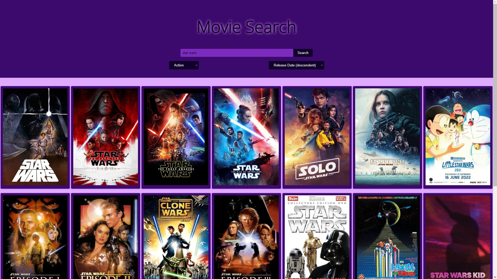

# Movie Search App

## Description

This is a simple web application that allows users to search for movies using The Movie Database (TMDb) API. Users can search by keyword, filter movies by genre, and sort results based on popularity, rating, or release date.

## Features

- Movie search using keywords
- Filter movies by genre
- Sort results by popularity, rating, or release date

## Technologies Used

- HTML
- CSS
- JavaScript
- The Movie Database (TMDb) API

## Setup

1. Clone this repository.
2. Replace `"YOUR_API_KEY"` with your actual TMDb API key in `script.js`.
3. Open `index.html` in your web browser.

## How to Use

1. Enter a search term in the search bar and click "Search" to see a list of matching movies.
2. Use the genre filter dropdown to filter movies by genre.
3. Use the sort by dropdown to change the sorting order of results.

## Screenshots

## Future Enhancements

- Implement a modal to display detailed movie information.
- Add pagination for better user experience.
- Allow users to save favorite movies using local storage.

## Contribution

Contributions are welcome! Feel free to open an issue or submit a pull request.

## License

This project is licensed under the [MIT License](LICENSE).

